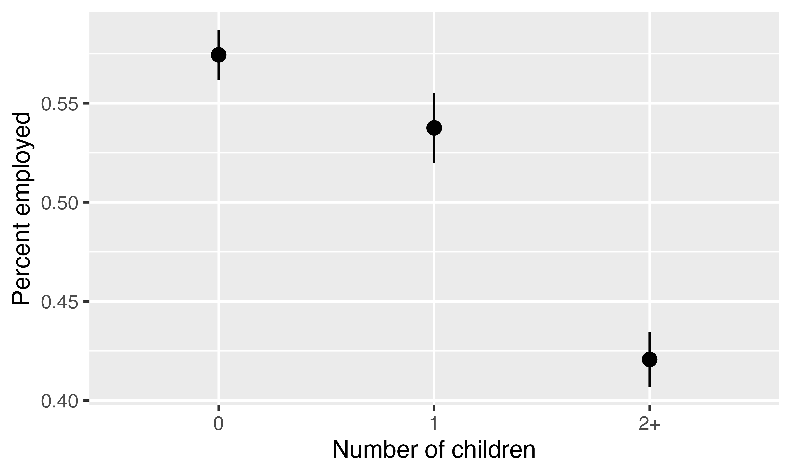
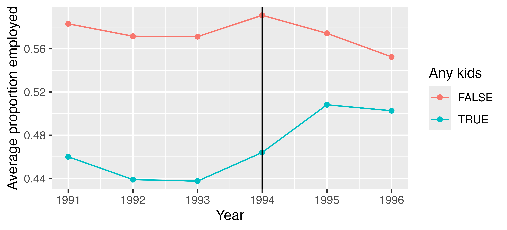

```{r}
#| label: setup
#| include: false

# Set some default chunk options
knitr::opts_chunk$set(
  fig.width = 6,
  fig.height = 6 * 0.618,
  fig.retina = 3,
  out.width = "80%"
)
```

# Overview

In 1996, Nada Eissa and Jeffrey B. Liebman [published a now-classic study on the effect of the Earned Income Tax Credit (EITC) on employment](http://darp.lse.ac.uk/papersdb/Eissa-Liebman_(QJE96).pdf) [@EissaLiebman:1996]. The EITC is a special tax credit for low income workers that changes depending on (1) how much a family earns (the lowest earners and highest earners don't receive a huge credit, as the amount received phases in and out), and (2) the number of children a family has (more kids = higher credit). See [this brief explanation](https://www.cbpp.org/research/federal-tax/policy-basics-the-earned-income-tax-credit) for an interactive summary of how the EITC works.

Eissa and Liebman's study looked at the effects of the EITC on women's employment and wages after it was initially substantially expanded in 1986. The credit was expanded substantially again in 1993. For this problem set, you'll measure the causal effect of this 1993 expansion on the employment levels and annual income for women.

A family must have children in order to qualify for the EITC, which means the presence of 1 or more kids in a family assigns low-income families to the EITC program (or "treatment"). We have annual data on earnings from 1991–1996, and because the expansion of EITC occurred in 1993, we also have data both before and after the expansion. This treatment/control before/after situation allows us to use a difference-in-differences approach to identify the causal effect of the EITC.

The dataset I've provided (`data/eitc.dta`) is a Stata data file containing more than 13,000 observations. This is non-experimental data—the data comes from the US Census's Current Population Survey (CPS) and includes all women in the CPS sample between the ages of 20–54 with less than a high school education between 1991–1996. There are 11 variables:

| Variable   | Definition                                                                          |
|:-----------|:------------------------------------------------------------------------------------|
| `state`    | The woman's state of residence[^state-codes]                                        |
| `year`     | The tax year                                                                        |
| `urate`    | The unemployment rate in the woman's state of residence                             |
| `children` | The number of children the woman has                                                |
| `nonwhite` | Binary variable indicating if the woman is not white (1 = Hispanic/Black)           |
| `finc`     | The woman's family income in 1997 dollars                                           |
| `earn`     | The woman's personal income in 1997 dollars                                         |
| `age`      | The woman's age                                                                     |
| `ed`       | The number of years of education the woman has                                      |
| `work`     | Binary variable indicating if the woman is employed (1 = employed)                  |
| `unearn`   | The woman's family income minus her personal income, in *thousands* of 1997 dollars |

[^state-codes]: These numbers are [US Census state codes](https://cps.ipums.org/cps-action/variables/STATECENSUS).

The code below loads the data. **You don't need to modify anything in this chunk of code---you only need to run it.**

```{r}
#| label: load-libraries-data
#| warning: false
#| message: false

library(tidyverse)
library(haven) # For loading data from Stata
library(parameters)

# Load EITC data
eitc <- read_stata("data/eitc.dta") |>
  # case_when() is a fancy version of ifelse() that takes multiple conditions
  # and outcomes. Here, we make a new variable named children_cat(egorical)
  # with three different levels: 0, 1, and 2+
  mutate(
    children_cat = case_when(
      children == 0 ~ "0",
      children == 1 ~ "1",
      children >= 2 ~ "2+"
    )
  )
```

# Task 1: Exploratory data analysis

It's always a good idea to get a feel for your data before doing any analysis. 

Calculate and visualize the differences in employment status, personal income, race, education, and age.

## Work (`work`)

Use `group_by()` and `summarize()` to calculate the proportion of women who are employed across these the three levels of children (*hint*: `work` is a binary 0/1 variable; if you calculate the average with `mean(work)`, you'll get the proportion). Recreate these results:

```r
#> # A tibble: 3 × 2
#>   children_cat avg_work
#>   <chr>           <dbl>
#> 1 0               0.574
#> 2 1               0.538
#> 3 2+              0.421
```

```{r}
#| label: children-averages-work

# Do stuff here
```

Run the code chunk below to see a plot.

```{r}
#| label: recreate-me-fig-work-plot
#| echo: false


```

Use `ggplot()`, `stat_summary()`, and `labs()` in the chunk below to re-create the plot above. Add some sort of useful caption to the figure using the `fig-cap` chunk option. (*Hint*: see Problem Set 3—both your own work and the answer key—and the diff-in-diff example at the class website for examples of using `stat_summary()`.) If you want to match the image exactly, use `fig-width: 5` and `fig-height: 2.5` in the chunk options.

```{r}
#| label: fig-averages-work

# Do stuff here
```

## Personal income (`earn`)

Go through the same process to calculate the average personal income across counts of children.

```{r}
#| label: children-averages-earn

# Do stuff here
```

```{r}
#| label: fig-averages-earn

# Do stuff here
```

## Race (`nonwhite`)

Go through the same process to calculate the proportion of Hispanic/Black women across counts of children.

```{r}
#| label: children-averages-nonwhite

# Do stuff here
```

```{r}
#| label: fig-averages-nonwhite

# Do stuff here
```

## Education (`ed`)

Go through the same process to calculate the average years of education across counts of children.

```{r}
#| label: children-averages-ed

# Do stuff here
```

```{r}
#| label: fig-averages-ed

# Do stuff here
```

## Age (`age`)

Go through the same process to calculate the average age across counts of children.

```{r}
#| label: children-averages-age

# Do stuff here
```

```{r}
#| label: fig-averages-age

# Do stuff here
```

## Summary

**Describe your findings in a paragraph.** How do these women differ depending on the number of kids they have?

Do that here.


# Task 2: Parallel trends

## Create treatment variables

Create a a copy of `eitc` and use `mutate()` to add two new columns:

- A variable for treatment status named `any_kids` (should be TRUE or 1 if `children` > 0) 
- A variable for the timing named `after_1993` (should be TRUE or 1 if `year` > 1993)

::: {.callout-tip title="Hint!"}

Remember you can use the following syntax for creating a new binary variable based on a test:

```r
# Use ifelse()
new_dataset <- original_dataset |>
  mutate(new_variable = ifelse(some_column > some_number, TRUE, FALSE))

# Shorter way that defaults to TRUE/FALSE
new_dataset <- original_dataset |>
  mutate(new_variable = some_column > some_number)
```

:::

```{r}
#| label: make-treatment-variables

# Do that here

# You'll probably want to call the new dataset eitc_clean or something similar
# eitc_clean <- eitc |> whatever()
```

## Check pre- and post-treatment trends

Create a new dataset named `eitc_by_year` that's based on `eitc_clean`. Calculate the proportion of employed women (`work`) in each year in both the treated and untreated groups (`any_kids`). (*Hint*: use `group_by()` and `summarize()`, and group by both `year` and `any_kids`.) Recreate these results:

```r
eitc_by_year
#> # A tibble: 12 × 3
#> # Groups:   year [6]
#>     year any_kids avg_work
#>    <dbl> <lgl>       <dbl>
#>  1  1991 FALSE       0.583
#>  2  1991 TRUE        0.460
#>  3  1992 FALSE       0.572
#>  4  1992 TRUE        0.439
#>  5  1993 FALSE       0.571
#>  6  1993 TRUE        0.438
#>  7  1994 FALSE       0.591
#>  8  1994 TRUE        0.464
#>  9  1995 FALSE       0.574
#> 10  1995 TRUE        0.508
#> 11  1996 FALSE       0.552
#> 12  1996 TRUE        0.503
```

```{r}
#| label: pre-treatment-trends
#| message: false

# Do stuff here
```

Run the code chunk below to see a plot.

```{r}
#| label: recreate-me-fig-pre-treatment-trends
#| echo: false


```

Use `ggplot()`, `geom_line()`, and `geom_point()` to plot `eitc_by_year` using colored lines and points, with year on the x-axis and average employment on the y-axis. Add a vertical line at 1994 (hint: use `geom_vline(xintercept = SOMETHING)`). If you want to match the image exactly, use `fig-width: 5.5` and `fig-height: 2.5` in the chunk options.

```{r}
#| label: fig-pre-treatment-trends

# Do stuff here
```

**Do the pre-treatment trends appear to be similar?**

Explain that here.


# Task 3: Difference-in-differences

## Diff-in-diff by hand-ish

Use `eitc_clean` and calculate the average proportion of employed women in the treated and untreated groups before and after the EITC expansion. (Hint: group by `any_kids` and `after_1993` and find the average of `work`.) 

```{r}
#| label: diff-diff-by-hand
#| message: false

# Do stuff here
```

Calculate the difference-in-differences estimate given these numbers. Recall from class that each cell has a letter (A, B, C, and D), and that the diff-in-diff estimate represents a special combination of these cells. The ["Diff-in-diff by hand" section of the example](https://evalsp26.classes.andrewheiss.com/example/diff-in-diff.html#diff-in-diff-by-hand) will be useful here.

|                    | Before 1993 | After 1993 | Difference |
|--------------------|-------------|------------|------------|
| Women with no kids |             |            |            |
| Women with kids    |             |            |            |
| Difference         |             |            |            |

**What is the difference-in-difference estimate? Discuss the result.** (Hint, these numbers are percents, so you can multiply them by 100 to make it easier to interpret. For instance, if the diff-in-diff number is 0.15 (it's not), you could say that the EITC caused the the proportion of mothers in the workplace to increase by 15 percentage points.)

Do that here.


## Diff-in-diff with regression

Create a regression model named `model_simple` to find the diff-in-diff estimate of the effect of the EITC on employment (`work`) using the `eitc_clean` data (*hint*: remember that you'll be using an interaction term). Use `model_parameters()` to show at the results.

```{r}
#| label: model-simple

# Do stuff here
```

**How does this value compare with what you found by hand? What is the advantage of doing this instead of making a 2x2 table?**

**Is this result statistically significant? Is it substantially significant?**

Discuss that here.

## Diff-in-diff with regression and controls

Create a new regression model named `model_complex` with demographic controls. Eissa and Liebman used the following in their original study:

- `unearn`: Non-labor income (family income minus personal earnings)
- `children`: Number of children
- `nonwhite`: Race
- `age`: Age
- `age^2`: Age squared
- `ed`: Education
- `ed^2`: Education squared

For the squared terms, you'll either need to make new variables in your dataset with `mutate()`, or include the squared terms in your model like `I(age^2)`^[The `I()` lets you define math operations in the regression model.], like `y ~ x + z + I(z^2)`. These are squared because age and education might have a nonlinear relationship with employment, where higher values might have a greater effect.

Display the results with `model_parameters()`.

```{r}
#| label: model-complex

# Do stuff here
```

**Does the treatment effect change? Is it statistically significant? Substantially significant? Interpret these findings.**

Discuss that here.


# Task 4: Robustness check with fake treatment

To make sure this effect isn't driven by any pre-treatment trends, we can pretend that the EITC was expanded in 1991 (starting in 1992) instead of 1993.

Create a new dataset named `eitc_fake_treatment` based on `eitc_clean` that does the following:

- Only includes data from 1991–1993 (hint: use `filter()`). 
- Includes a new binary before/after indicator named `after_1991` (hint: `year >= 1992`). 

Use regression to find the diff-in-diff estimate of the EITC on `work` (don't worry about adding demographic controls).

```{r}
#| label: fake-treatment

# Do stuff here
```

**Is there a significant diff-in-diff effect? What does this mean for pre-treatment trends?**

Discuss that here.


# References
